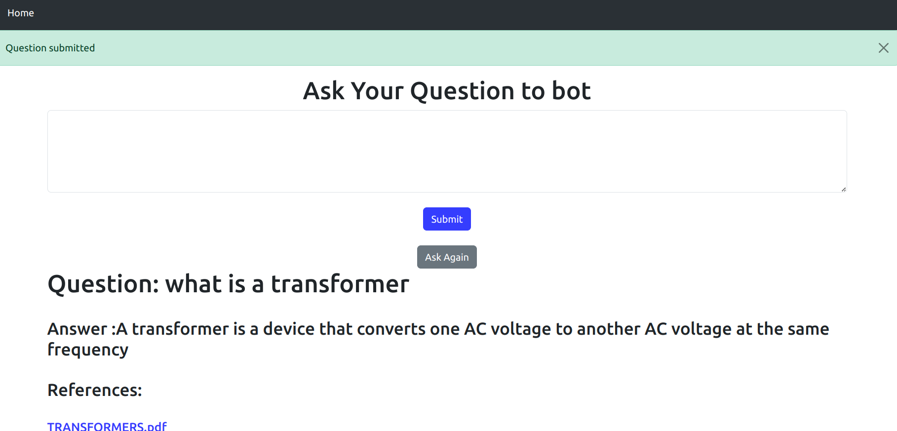
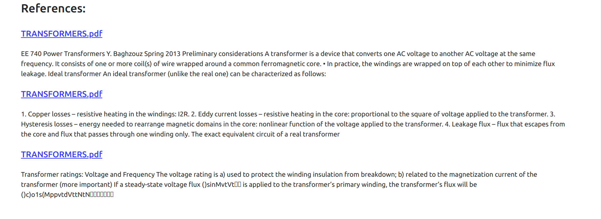

<h1 align="center"> PDF Chat Bot With Citation</h1>


<h2> :floppy_disk: Table of Content</h2>

 
  * [Introduction](#Introduction)
  * [Tools Used](#Data-Summary)
  * [Application UI](#Data-Summary)
  * [Application Installation](#Installation)


<h2> 📄 Introduction</h2>
A chatbot (originally a chatterbot) is a software application or web interface designed to mimic human conversation through text or voice interactions. In this project, I have built a chatbot to help to extract
information from the given documents as per the users choice and the references for the document where the 
data is extracted

  

<h2> 📑 Tools Used </h2>

1. Mysql

2. Langchain
   
3. Hugging Face

4. VS Code

5. Python

6. Huggingface embeddings

7. Docker 

8. Flask


<h2>🛠️ Application UI </h2>
 





<h2>🛠️ Application Installation </h2>

You can add your own documents in pdf_files folder <br>

Pre requisites: You must have docker in your system
 
1. Clone directory
```
git clone https://github.com/Muhliscm/OpenInPdfChatBot.git

```
2. Change dir
```
cd OpenInPdfChatBot

```

3. Build image

```
docker build -t openinpdfchatbot .

```


4. Run docker image
```
docker run openinpdfchatbot

```

 


<!-- CREDITS -->
<h2 id="credits"> :scroll: Credits</h2>

MUHLIS CM | Data Scientist | Machine Learning Engineer 

<p> <i> Contact me for Data Science Project Collaborations</i></p>

[](https://www.linkedin.com/in/muhliscm/)
[](https://github.com/Muhliscm)


